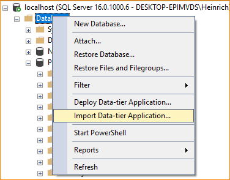
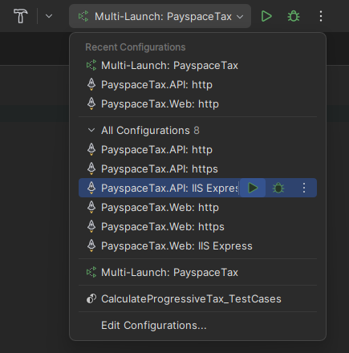
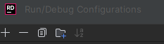

# Tax Calculator

## Run & Build Instructions

### 1. Restore Database on Local

- Restore `.bacpac` data-tier file, located in root of repository, on local SQL Server.

- Ensure that the database name is `TaxCalculator` after the restore.

### 2. Open the solution

- You can open this solution in your preferred IDE. Take note that I used `Jetbrains Rider` for development.

- The solution file should be located in root, `TaxCalculator.sln`

### 3. Ensure that you start multiple projects

- You need to assign `TaxCalculator.API` and `TaxCalculator.Web` to start in that order.

- Now you can run the solution with your new configuration.

- If the configuration settings works, you will see two new webpages open. `Swagger` and the `Web Application`

#### In Visual Studio 2022

- Right-click on the solution

- Click `Configure Startup Projects...`

- Toggle `Multiple Startup Projects`

- Make sure you set the `Action` of `TaxCalculator.API` and `TaxCalculator.Web` to `Start`

- **PS:** Make sure the `API` starts before `Web`

#### In JetBrains Rider 2023.3.3

- Click on `Edit Configurations...`

- Click on the `+`

- Look for the `Multi-launch` Option

- There should be a button called `Add configuration or task` in your newly created Multi-launch configuration.

- Add the API & Web Project as mentioned in the VS 2022 configuration steps, in the API > Web order.
